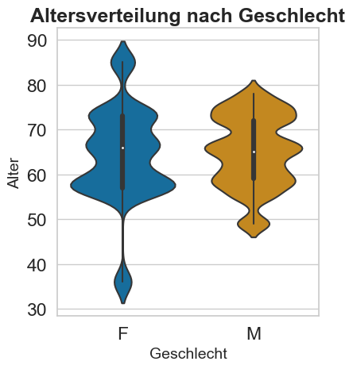
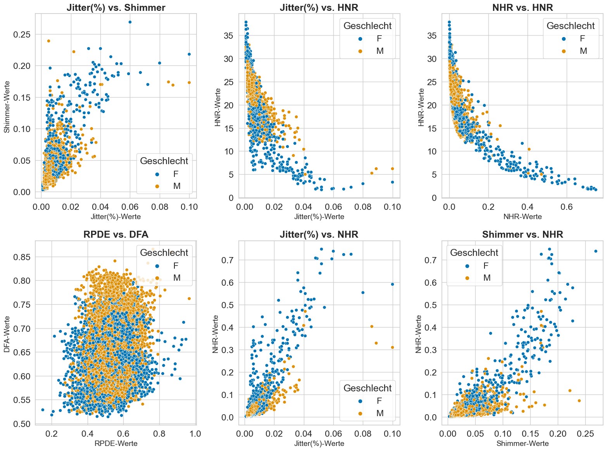
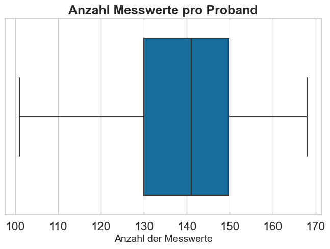
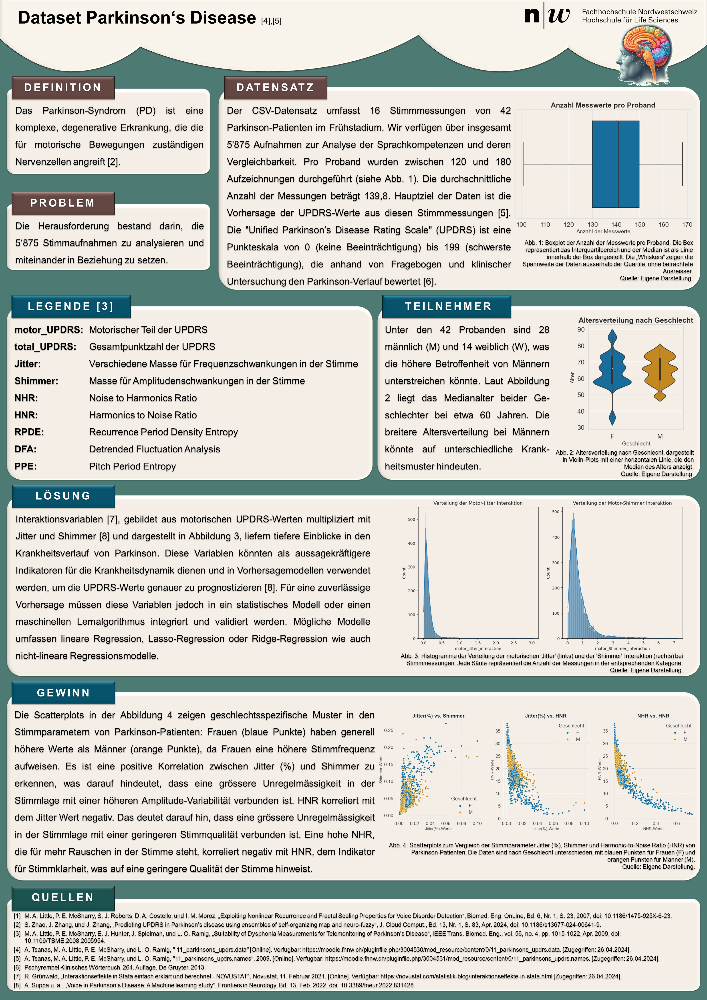

# 🧠 Parkinson-Datensatzanalyse – Sprachdatenanalyse & Visualisierung zur Vorhersage klinischer Scores

In diesem Data-Science-Projekt wurde ein Datensatz mit **5'875 Stimmmessungen von 42 Parkinson-Patienten** im Frühstadium analysiert.  
Ziel war es, Sprachparameter wie **Jitter**, **Shimmer**, **HNR**, **NHR** etc. im Zusammenhang mit der **UPDRS-Skala** (Unified Parkinson’s Disease Rating Scale) zu untersuchen und visuell darzustellen.

Ich war verantwortlich für das **Preprocessing, die Analyse und die Visualisierung** der Daten und konnte dabei wertvolle Erfahrungen im Umgang mit realen, medizinischen Datensätzen sammeln.

---

**🔧 Tech Stack & Methoden:**  
- Python · Pandas · NumPy · Matplotlib · Seaborn  
- CSV-Parsing · Plausibilitätsprüfungen · Feature Engineering  
- Visualisierung (Violin Plots, Boxplots, Heatmaps, Histogramme, Scatterplots)

---

**📌 Highlights:**  
- Überprüfung & Bereinigung der Daten (NaNs, Duplikate, inkonsistente Werte)  
- Umwandlung und Kategorisierung von Merkmalen (z. B. Geschlecht, Probanden-ID)  
- Feature Engineering inkl. Interaktionsvariablen wie `motor_UPDRS * Jitter(%)`  
- Erstellung statistischer Visualisierungen zur Analyse geschlechtsspezifischer Unterschiede  
- Korrelationen zwischen klinischen Scores & Sprachmerkmalen 

---

## 🧪 Datensatzbeschreibung

Der analysierte Datensatz stammt aus dem *Oxford Parkinson’s Disease Telemonitoring Dataset* und umfasst **biomedizinische Sprachmessungen** von 42 Patienten im Frühstadium. Die Aufnahmen wurden während eines sechsmonatigen Heim-Monitorings gesammelt. Jeder Eintrag repräsentiert eine einzelne Sprachaufnahme.

- 📦 **Gesamtanzahl der Messungen:** 5’875  
- 👥 **Teilnehmer:** 42 Parkinson-Patienten  
- 📊 **Messgrössen:** 16 Sprachmerkmale (z. B. Jitter, Shimmer, HNR, NHR), Alter, Geschlecht, Testzeitpunkt

### Merkmalsübersicht (Auszug)

| Feature              | Beschreibung                                                 |
|----------------------|---------------------------------------------------------------|
| `subject#`           | ID des Probanden                                              |
| `age`, `sex`         | Alter & Geschlecht                                            |
| `test_time`          | Tage seit Beginn der Studie                                   |
| `motor_UPDRS`        | Motorischer Score der UPDRS                                   |
| `Jitter`, `Shimmer`  | Frequenz- & Amplitudenvariation in der Stimme                |
| `NHR`, `HNR`         | Noise-to-Harmonics / Harmonics-to-Noise Ratio                |
| `RPDE`, `DFA`, `PPE` | Nichtlineare Komplexitäts- & Entropiemasse                   |

Weitere Informationen unter:  
🔗 [UCI Parkinson's Dataset](https://archive.ics.uci.edu/dataset/189/parkinsons+telemonitoring)

---
## 📂 Projektstruktur

- 📁 `data/`
  - `parkinsons.csv` (Originaldatensatz)
  - `preprocessed_dataset.csv` (nach Bereinigung)
- 📁 `notebooks/`
  - `preprocessing.ipynb` – Bereinigung, Feature Engineering
  - `visualization.ipynb` – Visualisierung & Analyse
- 📁 `images/`
  - Grafiken & Poster für README

---
## 🖼️ Beispielhafte Visualisierungen

### Altersverteilung nach Geschlecht

### Scatterplot-Matrix ausgewählter Merkmale

### Anzahl Messwerte pro Proband

### Analyseposter (Projektzusammenfassung)

---

## 📄 Lizenz

Dieses Projekt wurde im Rahmen eines Hochschulprojekts erstellt und dient ausschliesslich zu Demonstrations- und Lernzwecken.

---

### 📚 Quelle des Datensatzes

Der analysierte Datensatz stammt aus dem öffentlich zugänglichen *Oxford Parkinson's Disease Telemonitoring Dataset*, verfügbar unter:  
🔗 [UCI Machine Learning Repository – Parkinson's Dataset](https://archive.ics.uci.edu/dataset/189/parkinsons+telemonitoring)
